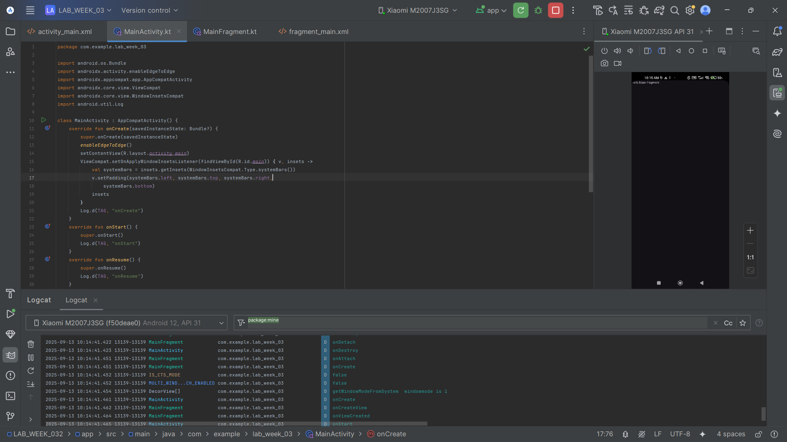
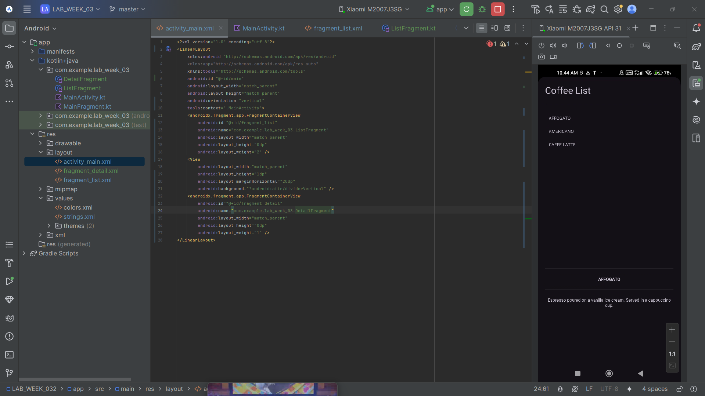
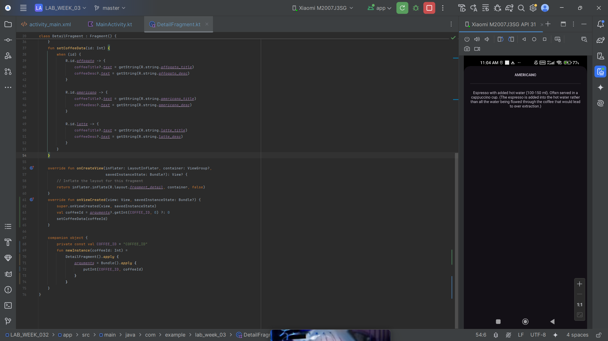
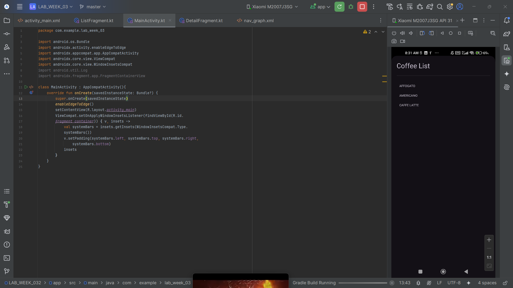
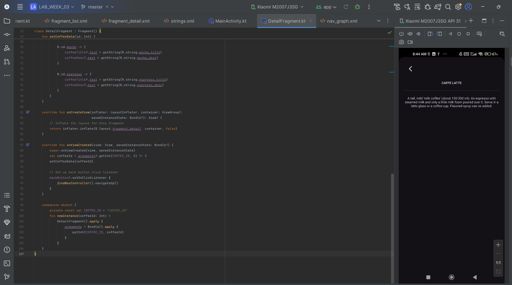

### Submitted by:
* **Nama:** Fernando Sunarto
* **NIM:** 00000083441
* **Class:** AL
---

### Project Files

| Description | APK File | Screenshot |
| --- | --- | --- |
| **Commit 1: Fragment Lifecycle** | [Download](APK/Commit1_Fragment_Lifecycle.apk) |  |
| **Commit 2: Static Fragment** | [Download](APK/Commit2_Static_fragment.apk) |  |
| **Commit 3: Dynamic Fragment** | [Download](APK/Commit3_Dynamic_Fragment.apk) |  |
| **Commit 4: Jetpack Navigation** | [Download](APK/Commit4_Jetpack_Navigation.apk) |  |
| **Commit 5 (Exercise): Add Back Button & Extend List ** | [Download](APK/Commit5_add_back_button_and_extend_list.apk) |  |
